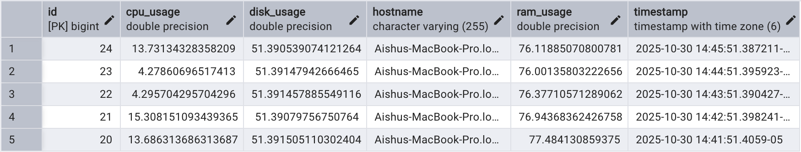

# Java System Health Monitor (Backend Server)

This is the backend server for a two-part system health monitoring application. This server is a Spring Boot application that:
1.  Listens for incoming health data (CPU, RAM, Disk) from one or more "Agents."
2.  Connects to a PostgreSQL database to store this time-series data.
3.  Exposes a RESTful API to receive data.

The corresponding **Agent** can be found here: [https://github.com/ashram15/system-monitor-agent](https://github.com/ashram15/system-monitor-agent)



### Architecture
This project uses a distributed, client-server model. The Agent (client) collects real-time metrics and sends them to this Server, which persists them in the database.

---

### Tech Stack
* **Server:** Java 17, Spring Boot 
* **API:** Spring Web (RESTful API)
* **Database:** PostgreSQL
* **Data Persistence:** Spring Data JPA / Hibernate

---

### How to Run This Project

**1. Prerequisites:**
* Java 17 (Temurin)
* PostgreSQL Server (e.g., Postgres.app)
* Maven
* An API Client (like Postman)

**2. Database Setup:**
1.  Make sure your PostgreSQL server is running (e.g., `Postgres.app` is started).
2.  Create a database named `postgres` (or your preferred name).

**3. Configuration (The Most Important Step):**
This project *requires* an `application.properties` file to run, which is **not** included in this repository for security reasons (as defined in the `.gitignore` file).

To run this project, you must create your own file at:
`src/main/resources/application.properties`

And add your local database credentials to it:

```properties
# Connect to your local database
spring.datasource.url=jdbc:postgresql://localhost:5432/postgres
spring.datasource.username=YOUR_POSTGRES_USERNAME
spring.datasource.password=YOUR_POSTGRES_PASSWORD

# Spring JPA Settings
spring.jpa.database-platform=org.hibernate.dialect.PostgreSQLDialect
spring.jpa.hibernate.ddl-auto=update